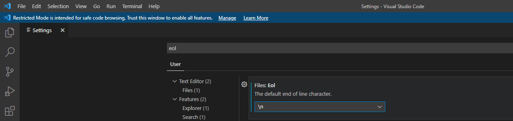

# CRLF轉LF的問題
## 說明
* windows是CRLF，linux/mac是LF
* git會根據autocrlf將CRLF轉LF
* 若都是linux/mac就沒問題
* 由於同一個專案會被不同作業系統使用，因此會有格式轉換問題
* 在Windows下使用autocrlf=true，感覺最後一行會有問題
## Windows的設定
* 一開始安裝git，就選擇autocrlf=false
* 將vscode的EOL設定成\n

