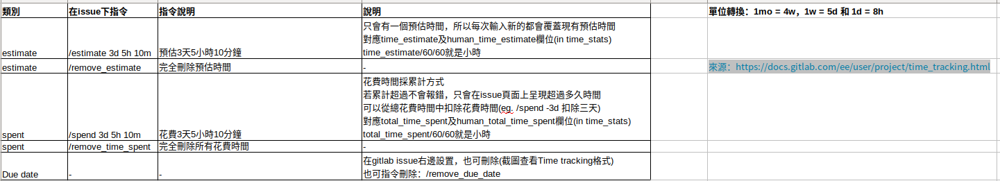

# gitlab api

## gitlab文件說明
* https://docs.gitlab.com/ee/api/projects.html#list-all-projects
* https://docs.gitlab.com/ee/api/issues.html#list-issues
* https://docs.gitlab.com/ee/api/notes.html#list-project-issue-notes

## URL測試
* 建立token：zwZXqHcEJdxgUEZcebYk
* 範例：抓取group id 15的所有issue
  ```sh
  curl --header "PRIVATE-TOKEN: zwZXqHcEJdxgUEZcebYk" "http://192.168.101.XXX/api/v4/groups/15/issues"
  ```
* 範例：抓取project id 90的所有issue
  ```sh
  curl --header "PRIVATE-TOKEN: zwZXqHcEJdxgUEZcebYk" "http://192.168.101.XXX/api/v4/projects/90/issues"
  ```
* 範例：抓取project id 90且issue id 2的所有comment
  ```sh
  curl --header "PRIVATE-TOKEN: zwZXqHcEJdxgUEZcebYk" "http://192.168.101.XXX/api/v4/projects/90/issues"
  ```
* 範例：使用參數per_page及page，設定每次回應筆數及第幾頁
  ```sh
  # 預設一次回應20筆
  # 預設sort by desc，所以第一筆ISSUE應為最新建立的ISSUE
  curl --header "PRIVATE-TOKEN: zwZXqHcEJdxgUEZcebYk" "http://192.168.101.252/api/v4/projects/80/issues?per_page=3&page=1"
  ```

## URL測試-參數用法
```sh
# 一般，筆數20
curl --header "PRIVATE-TOKEN: zwZXqHcEJdxgUEZcebYk" "http://192.168.101.XXX/api/v4/projects"

# 可減少資料量
curl --header "PRIVATE-TOKEN: zwZXqHcEJdxgUEZcebYk" "http://192.168.101.XXX/api/v4/projects?simple=true"

# 個人專案
curl --header "PRIVATE-TOKEN: zwZXqHcEJdxgUEZcebYk" "http://192.168.101.XXX/api/v4/projects?simple=true&owned=true"

# 抓取30筆資料。預設抓取20筆，最大100筆
curl --header "PRIVATE-TOKEN: zwZXqHcEJdxgUEZcebYk" "http://192.168.101.XXX/api/v4/projects?simple=true&per_page=30"

# 回傳有Web_code關鍵字的project
# 但是中文不行, 關鍵字中有空格也不行,例如"Cup Detection and SKU"
curl --header "PRIVATE-TOKEN: zwZXqHcEJdxgUEZcebYk" "http://192.168.101.XXX/api/v4/projects?search=Web_code"
```

## https異常狀況
* 處理方式為忽略`驗證`步驟，在curl指令中增加`--insecure`
```
curl: (60) SSL certificate problem: unable to get local issuer certificate
More details here: https://curl.haxx.se/docs/sslcerts.html

curl failed to verify the legitimacy of the server and therefore could not
establish a secure connection to it. To learn more about this situation and
how to fix it, please visit the web page mentioned above.
```

## 其他
* 有些url需要管理者權限，否則會回403，例如Project Aliases API


---

# 建立時間

