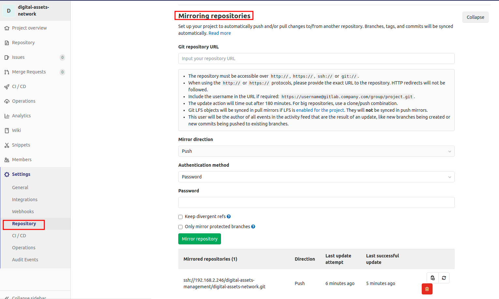
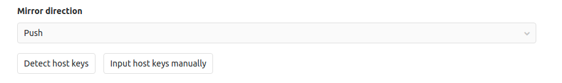
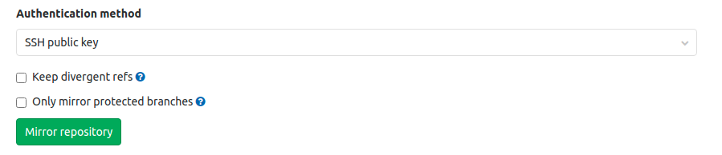
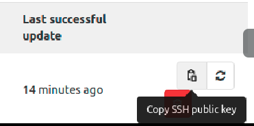
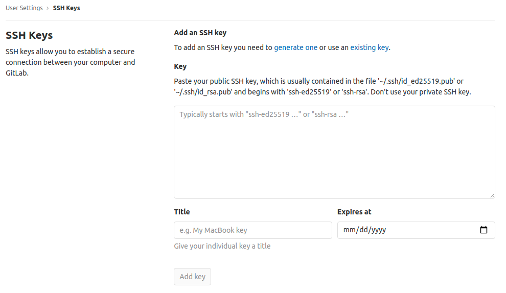

# gitlab專案同步
有A B兩台gitlab服務器，git push到A後會自動同步到B

## 同步方式
* A跟B各建立一個相對應的專案

* 在A專案中，如下圖
  
  
* Git repository URL
  * 輸入B專案的ssh URL
  * 一開始就要直接輸入正確，不可以將http URl貼上去後再調整，會有異常
  
* Mirror direction
  * push
  * 下圖兩個按鍵要點選
  
  
* Authentication method
  * 選SSH public key
   
  
* 點選Mirror repository就可建立連結，如第一張圖

* 點選下圖複製按鍵
   

* 將剛剛複製的key貼到B，就完成同步專案了

