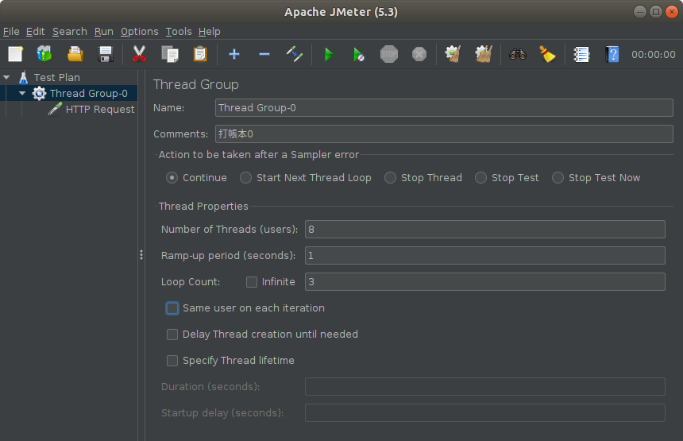
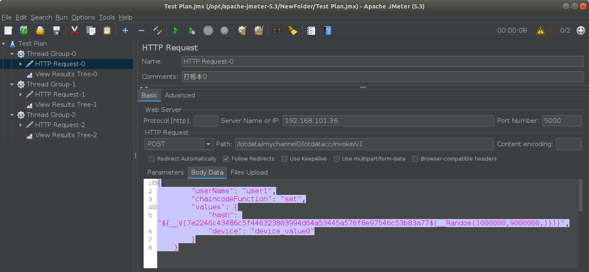
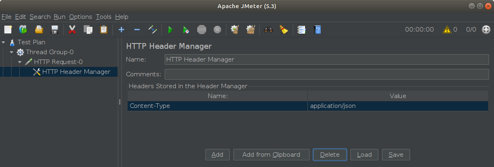

# **jmeter測試 (修改圖片上的數值 及json格式)**

## Java安裝
* 指令
    ```sh
    sudo apt update
    ```
    ```sh
    sudo apt install openjdk-8-jdk
    ```

* 查看路徑
    * 查看是否有: /usr/lib/jvm/java-8-openjdk-amd64
    ```sh
    update-alternatives --query java | grep /usr/lib/jvm/java-8-openjdk-amd64
    ```
    結果:
    ```
    Best: /usr/lib/jvm/java-8-openjdk-amd64/jre/bin/java
    Value: /usr/lib/jvm/java-8-openjdk-amd64/jre/bin/java
    Alternative: /usr/lib/jvm/java-8-openjdk-amd64/jre/bin/java
    java.1.gz /usr/lib/jvm/java-8-openjdk-amd64/jre/man/man1/java.1.gz

    ```

* 添加環境變數
    ```sh
    vim ~/.bashrc

    # 在~/.bashrc此行環境變數
    export JAVA_HOME=/usr/lib/jvm/java-8-openjdk-amd64
    export PATH=$PATH:$JAVA_HOME/bin


    source ~/.bashrc
    ```

---

## jmeter安裝
* [下載](https://jmeter.apache.org/download_jmeter.cgi)
    * 下載可執行檔案 apache-jmeter-5.3.tgz
    * 解壓縮

* 安裝
    ```sh
    sudo mv apache-jmeter-5.3 /opt/apache-jmeter-5.3
    
    sudo ln -s /opt/apache-jmeter-5.3/ /opt/jmeter    
    ```

* 啟動
    ```sh
    cd /opt/jmeter/bin

    ./jmeter.sh
    ```
---

## jmeter 功能

* 放大: Options -> Zoom In

---

## api測試

### 建立所需元件
1. 建立Thread Group
    ```
    右鍵點擊Test Plan --> Add --> Thread(Users) --> Thread Group
    ```
2. 建立HTTP Request
    ```
    右鍵點擊Thread Group --> Add --> Sampler --> HTTP Request
    ```
3. 建立HTTP Header Manager
    ```
    右鍵點擊HTTP Request --> Add --> Config Element --> HTTP Header Manager
    ```
4. 建立View Results Tree
    ```
    右鍵點擊Thread Group --> Add --> Listener --> View Results Tree
    ```

### 填寫參數
1.  Thread Group
    * 
2.  HTTP Request
    * 
        ```
        /iotdata/mychannel0/iotdatacc/invoke/v1
        ```
        ```json
        {
            "userName": "user1",
            "chaincodeFunction": "set",
            "values": {
                "hash": "${__V(7e2246c43486c5f446323803994d64a53445a576f8e97546c53b83a77${__Random(1000000,9000000,)})}",
                "device": "device_value0"
            }
        }
        ```
3. HTTP Header Manager
    * 
        ```
        Content-Type=application/json
        ```


---
### 參考

https://ithelp.ithome.com.tw/articles/10203900

https://stackoverflow.com/questions/22009999/how-to-insert-delay-between-each-requests-in-jmeter

https://kknews.cc/zh-tw/code/o5vr6.html

https://stackoverflow.max-everyday.com/2017/09/jmeter/

https://www.jianshu.com/p/20fac18f478f


